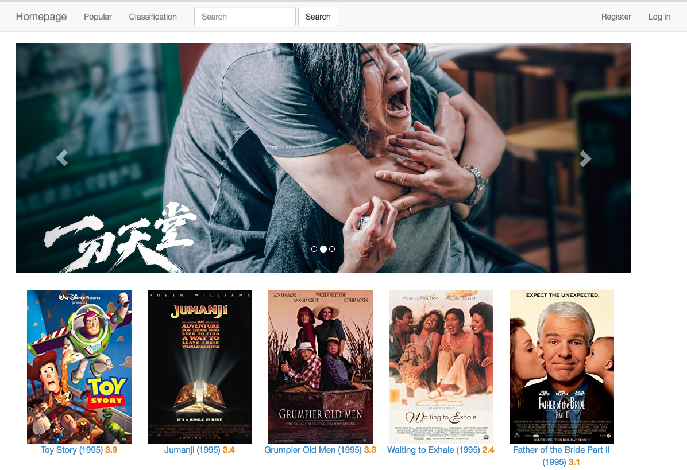

# Document for atom-database-project
This repo record a project which built a movie recommendation system based on the Django framework.

## Catalog

[TOC]

<div STYLE="page-break-after: always;"></div>

## Environment dependencies
```text
python       3.10
Django       4.1
mysql        8.0
PyMySQL      1.0.2
sqlparse     0.4.3
```

## Compile and Deploy

### Python Preparation

```shell
# Using pyenv, pyenv-virtualenv to control python version
# For mac user, Homebrew is recommended
# For win user, pyenv package can be downloaded on the github website: https://github.com/pyenv/pyenv
# pyenv 2.3.8
brew install pyenv
brew install pyenv-virtualenv

# for zsh
eval "$(pyenv init -)"
eval "$(pyenv virtualenv-init -)"

# activate python environment
pyenv install 3.10.8
pyenv virtualenv 3.10.8 atom
pyenv activate atom

# pip install the dependencies pkgs
cd /path/to/project
pip install -r requirements.txt --no-dependencies
```

<div STYLE="page-break-after: always;"></div>

### MySQL Preparation

```shell
# Mysql was applied to this project, the default user is root, password: 123456
# If the default settings are changed, please update the 'DATABASES' in Movie_recommendation_system/setting.py
mysql -uroot -p
drop database movie_recommend_db;
create database movie_recommend_db;
use movie_recommend_db;
# load the data
source /path/to/project/database/movie_recommend_db.sql
```

### Migrate & Activate
```shell
cd /path/to/project
python manage.py migrate
python manage.py runserver localhost:8000
```

### Result
Open the project homepage by inputting the link http://localhost:8000/ into the browser.


## Demo
### Homepage


### Login & Register


### Popular


### Classification


### Search


### Rating


### Rating History


### Recommend


## To Do List

- [ ] Beautify the UI
- [ ] Optimize the Movie Recommendation Algorithm
- [ ] Add a Spider Module
- [ ] Docker Deployment